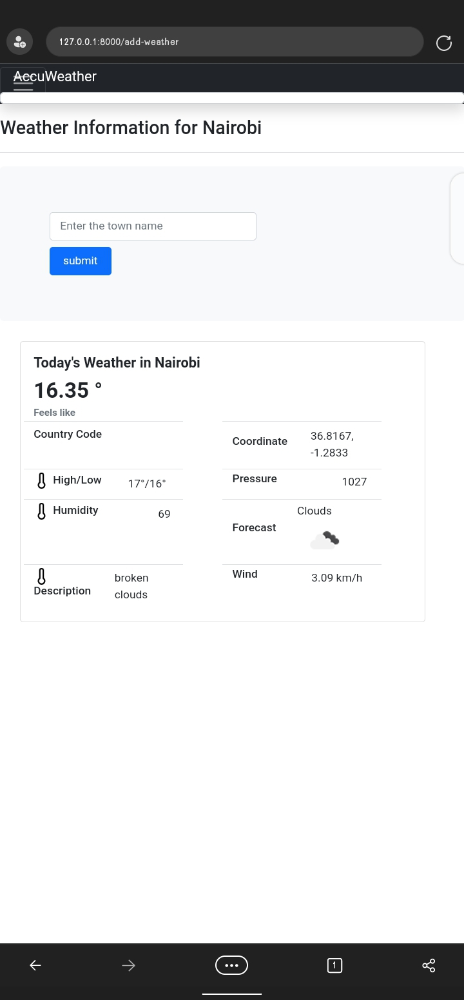

**Django Weather App**
The application uses the OPENWEATHERAPI to get weather data for the requested city.

When the user requests data for a particular city. We first check the database for a match. If no matches, we call the OpenWeather API for data, save it in the db then return to the user.
This helps reduce the number of times we call the OpenWeather API.

***TODOS***
1. *Implement a cron job/scheduler to call the OpenWeather API for the cities the user wants to track or update the database with new information after a specified period.*

